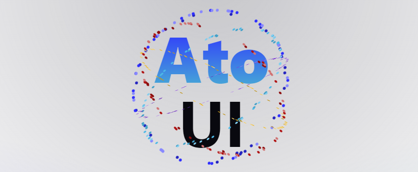

# Ato UI

[](https://www.npmjs.com/package/ato-ui)
[](https://github.com/bennymi/ato-ui/blob/main/LICENSE)
[](https://discord.gg/7PXN3fs3tN)

The elemental UI component library for Svelte, built with UnoCSS and Melt UI.

## 🚀 Getting Started

Check out the [documentation](https://ato-ui.vercel.app/) for a detailed installation guide and project setup.

```shell
pnpm add -D ato-ui
```

## ✨ Features
- 🦄 Headless + Styled components
- 🎨 Themeable with an easy to use designers page
- 🎯 Written in TypeScript
- 👍 Strict adherence to [WAI-ARIA guidelines](https://www.w3.org/WAI/ARIA/apg/) (built on top of accessible headless libraries)
- ✈️ Convenient CSS shortcuts & tokens
- 😃 Pure CSS icons of all your favourite icon sets thanks to iconify and [UnoCSS](https://github.com/unocss/unocss)

## 👋 Community

Want to discuss something with us? Come join us on [Discord](https://discord.gg/7PXN3fs3tN), we would love to see you there.

<a href="https://discord.gg/7PXN3fs3tN" alt="Ato UI Discord community">
<picture>
  <source media="(prefers-color-scheme: dark)" srcset="https://invidget.switchblade.xyz/7PXN3fs3tN">
  
</picture>
</a>

## ⚒️ Contributions

Developers interested in contributing should read the [Code of Conduct](./CODE_OF_CONDUCT.md) and the [Contribution Guide](./CONTRIBUTING.md). PRs are welcomed. Find an open issue you can work on and come discuss it with us on discord.

## 🌸 Credits

The following amazing projects made this library possible and / or inspired features:

- [UnoCSS](https://github.com/unocss/unocss)
- [Melt UI](https://github.com/melt-ui/melt-ui)
- [Skeleton](https://github.com/skeletonlabs/skeleton)
- [Onu UI](https://github.com/onu-ui/onu-ui)
- [Anu](https://github.com/jd-solanki/anu)
- [MDsveX](https://github.com/pngwn/mdsvex)
- [TailwindCSS](https://github.com/tailwindlabs/tailwindcss)
- [WindiCSS](https://windicss.org/)
- [Shiki](https://github.com/shikijs/shiki)

## License

[MIT](./LICENSE) License &copy; 2023-PRESENT [Benedikt Mielke](https://github.com/bennymi)
